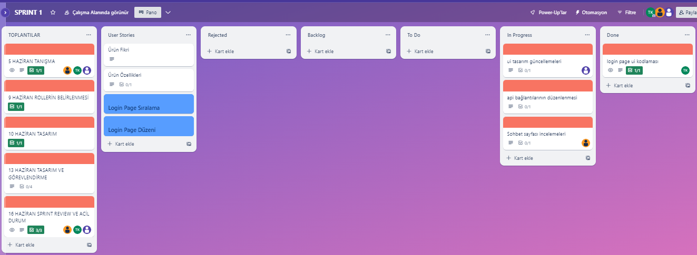
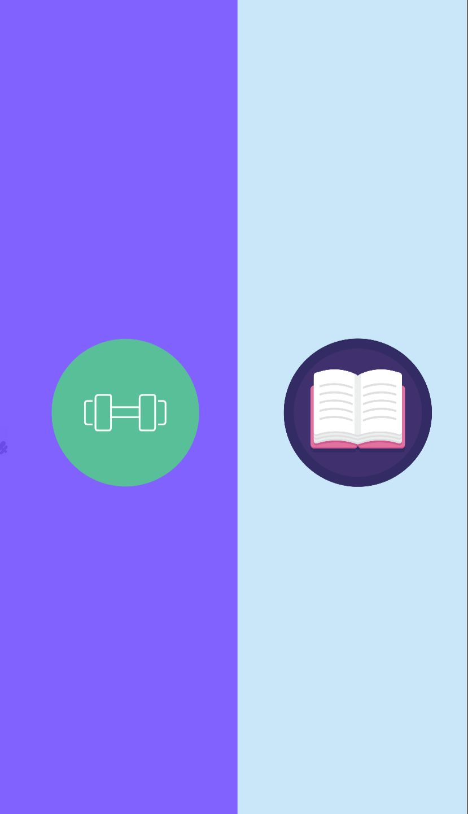
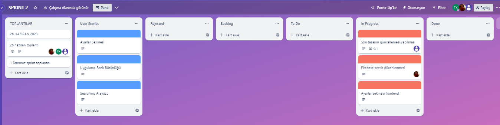
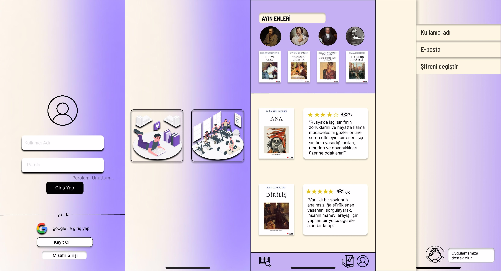
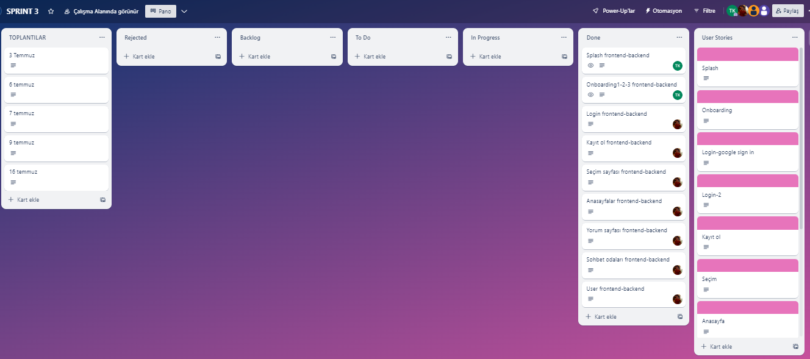
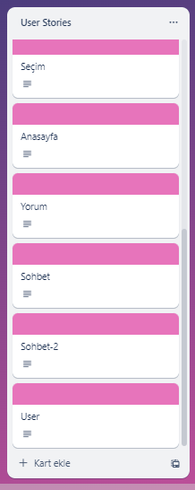
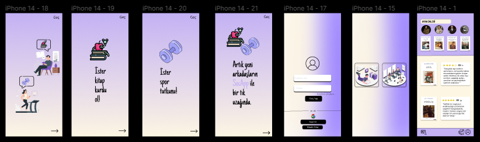
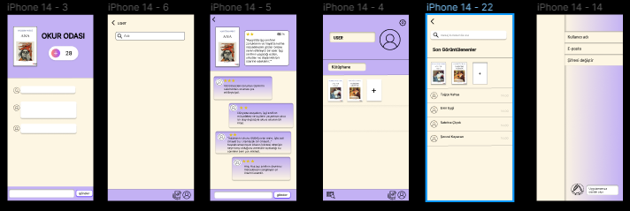
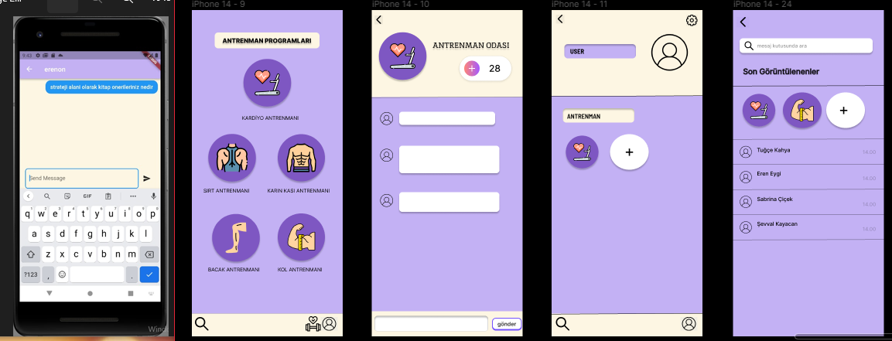

# **Takım İsmi**

Takım F-84

# Ürün İle İlgili Bilgiler
1. Aynı ilgi alanına sahip bireyleri bir araya getirmek,
2. Kişiler arası deneyim paylaşımı,
3. Faydalı alışkanlıkların devamlılığını sağlamak,
4. Aynı ilgi alanları sayesinde yeni kişilerle tanıştırmak,
5. Kitap okuma süreçlerinde zorluk çekenler için kitaplarla ilgili yorumlar göstererek motive etme,
6. Okudukları aynı kitapla ilgili sohbet etmelerini kolaylaştıran okur odaları,
7. Okur odalarında edindikleri arkadaşlarıyla bireysel sohbetleşmelere olanak sağlamak,
8. İlgi alanlarıyla ilgili sürekli iletişim sayesinde alışkanlıklarının devamlılığını sağlamak,
9. Sporcuların sohbet odalarında faydalı spor setleri ve antrenmanları ile ilgili deneyimleri sayesinde birbirlerine spor süreçlerinde destek olmak, 
10. Spor ilgi alanı için birebir sohbet özelliğini kullanarak, kişinin kendine uygun bir buddy eşleşmesi sağlayarak bu süreçte motive kalmasını ve bu alışkanlığın süreklilik kazanmasını  amaçlamak,
11. Faydalı alışkanlıklar sayesinde genişleyen sosyal çevre,
12. Aktivitelerinin devamlılığını sağlayacak güçlü motivasyon,
13. Kitap kurtları için kitaplarla ilgili istedikleri zaman derin sohbetlerde katkı sağlamayı mümkün kılmak,
14. Spor tutkunları için kendileri gibi tutkun buddy'lerini bulmak.
15. Yeni gelecek hobi alanları ile kullanıcılarımızın yeni hobiler edinmelerine öncü olmak.

## Takım Elemanları

- Muhammet Eren Eygi - Product Owner / Developer
- Tuğçe Kahya - Scrum master / Developer
- Şevval Kayacan - Developer / ui designer
- Sabrina Çiçek - Developer
- İsmail Yılmaz - Gruptan Ayrılan Üye

## Ürün İsmi

-- SocApp --

## Product Backlog URL

[F-84 Trello Backlog Board](https://trello.com/w/f84_product_backlog)

## Ürün Açıklaması

- SocApp uygulamamız ile benzer aktiviteleri yapan bireylerin aynı platform içinde bir araya getirmeyi ve sosyalleşmelerine katkı sağlamayı hedeflemekteyiz. Uygulamamız sayesinde (şimdilik) aynı kitabı okuyanlar kitaba ait sohbet kanalına dahil olup kitap hakkında sohbet edebilecekler, aynı antrenmanı yapacak bireyler de birbirleriyle yine o antrenmana ait kanallarda tanışabilir ve antrenmanlarıyla ilgili konuşabilecekler. Şimdilik her iki kitlenin de aynı uygulamada sosyalleşmelerini hedeflemekteyiz. Samimi ve güvenilir bir platform oluşturmak istedik.Bootcamp süresi kapsamında iki aktivite için geliştirme yapılmasını hedeflenmektedir.

- **Uygulama birincil fonksiyonu**: 
 Aynı ilgi alanına sahip insanları bir araya getirerek etkileşim sağlamak ve bu kişiler arasında deneyim aktarımı sağlayarak bir nevi kılavuz hizmeti vererek faydalı alışkanlıkların sürekliliğini ve verimliliğini arttırmayı amaçalamaktayız. Kitap okuyan kullanıcılarımızın kitap okuma sürecinin başında yorum ekranı sayesinde seçim aşamasına ışık tutarken  sonrasında aynı kitapla ilgili sohbet etmelerini sağlayan grup sohbeti ortamı oluşturmak için okur odası iletişimi sağlayarak kitap üzerinde farklı bakış açıları kazanılması ve sağlanılan etkileşim sayesinde kitap okuma serüvenine yol verecek fikirler almasını sağlayarak kitap okuma alışkanlığının sağlanması ve gelişmesi amaçlanmaktadır
Spor yapan kullanıcılarımızın ise günlük aktivitelerinde yapacağı antrenman alanında ortak insanlarla bir araya getirerek faydalı antrenman ve set önerileri almasını teşvik ederek fiziksel gelişimine katkı sunarken  birebir sohbet özelliğini kullanarak kendine uygun bir buddy eşleşmesi sağlayarak bu süreçte motive kalmasını sağlayarak bu alışkanlığın süreklilik kazanmasını  amaçlamaktayız .

- **Uygulama ikincil fonksiyonu**: 
Faydalı alışkanlıklar etrafında bir sosyal çevre kazanılması ve bu alanda çalışmalarının arttırılmasının sağlanması. bununla paralel olarak
Kullanıcıların okudukları ortak kitaplarla ilgili okur odasında yapılan sohbetlerle beraber farklı bakış açıları sayesinde bu yöne olan ilginin ve eforun arttırılması ve tanıştıkları diğer kullanıcılarla, her konuda bireysel sohbet edebilmelerini sağlayacak  bireysel sohbet alanları oluşturarak sosyal çevrenin de olumlu yönde gelişmesi amaçlanmaktadır  ,
Spor yaparken sağlıklı programlama yapmada ve uygun sosyal çevre oluşturmada   zorlanan bireyler için grup sohbetinin yanında, uygulamamız sayesinde tanıştıkları buddy'leriyle baş başa sohbet etmelerini sağlamak ve farklı antrenman yöntemlerini fark etmeleri için ve spora devam etmelerini için kullanmalarını hedeflemekteyiz.

- **Uygulama üçüncül fonksiyonu**:
 Rutinlerin sağlıklı aktiviteler etrafında  şekillenmesi ilerleyen zamanda yeni hobiler eklenerek farklı hobi alanlarına ilgi uyandırarak bilinç ve sağlıklı bir rutin oluşturulması amaçlanmaktadır. Buna binayen ingilizce konuşma odaları,sağlıklı beslenme odaları gibi seçenekler düşünülebilir

## Ürün Özellikleri

- Spor yapan kullanıcıları bir araya getirerek sosyalleşmelerini sağlamak
- Spor yapmak isteyen kullanıcıların, ilgilendikleri alanla ilgili grup sohbetlerine katkı sağlamaları,
- Ürünümüz sayesinde tanışan bireylerin grup dışında bireysel sohbet etmelerine olanak sağlamak,
- Kitap okuyan kullanıcıları sohbet kanalına dahil etme ve sosyalleşmelerine imkan sunma
- Yeni okumak istedikleri kitaplarla ilgili okur yorumlarıyla okuma süreçlerini heyecanlandırma
- Aynı yazardan kitap önerileri
- Sohbet edebilecekleri efektif bir ortam
- Aynı uygulamadan iki farklı hobileriyle ilgili sosyalleşmeye fırsat verme

## Hedef Kitle

- Sporla ilgilenen kişiler
- Spor yapmak isteyen kişiler
- Spor eğitmenleri
- Kitap okuyucuları
- Kitaplarla ilgili sohbet etmek isteyen kişiler
- Sosyalleşmek isteyen kişiler
- 15 - 65 yaş arası kullanıcılar
- Hobilerini gerçekleştirirken yeni kişilerle tanışmak isteyenler

# Jüriye not:

---

# Sprint 1

- **Sprint Notları** : Tasarım odaklı toplantılar gerçekleştirildi.

- **Sprint içinde tamamlanması tahmin edilen puan**: 100 Puan

- **Puan tamamlama mantığı**: Toplamda proje boyunca tamamlanması gereken 310 puanlık backlog bulunmaktadır. 3 sprint'e bölündüğünde ilk sprint'in 100 ile başlaması gerektiğine karar verildi.

- **Backlog düzeni ve Story seçimleri**: Backlog'umuz ekip üyelerine geç ulaşılmasına ve ekipten ayrılan üyenin olmasına rağmen oluşturulmuş ve süreç içerisinde güncellenmek zorunda kalınmıştır. Puan tamamlama mantığı göz önünde bulundurularak story yazılmıştır. Trello çalışma alanında user stories başlığı altında açıklamalar yapılmıştır.

- **Daily Scrum**: Daily Scrum toplantılarının genellikle zoom üzerinden yapılmaya çalışılsa da zamansal sebeplerden ötürü Whatsapp üzerinden de yapılmıştır. Daily Scrum toplantısı örneği jpeg veya word olarak Readme'de tarafımızdan paylaşılmaktadır:
[Sprint 1 Daily Scrum Chats](Sprint1documents/DailyScrumMeetingNotesSprint1.docx)

- **Sprint board update**: Sprint board screenshotları:

- **Ürün Durumu**: Ekran görüntüleri:
  
 
 
- **Sprint Review**:
Alınan kararlar: Kullanıcı login sayfası ui tasarımları yapılmış ancak kodlanma kısmına ekip içi sebeplerden ötürü geçilememiştir., API incelemeleri devam etmektedir.
Süreçte ekip için iyi olan durumlar: Üyeler birbirini tanıdı, yapacakları hakkında araştırmalar yaptı. Herkesin ürüne bakış açısı olumlu yönde oldu ve diğer iki sprint için daha aktif olmaları yönünde konuşmalar yapıldı. Ürünün özellikleri ve tasarımıyla ilgili kararlar netleştirildi.
Sprint Review katılımcıları: Muhammet Eren Eygi, Tuğçe Kahya, Sabrina Çiçek, Şevval Kayacan

- **Sprint Retrospective:**
  - Roller ile ilgili düzenleme yapılmış, ekipten biri ilk sprintin bitmesine bir gün kala ayrıldığı için developer görevleri düzenlenmiştir. (Bu durum Scrum Master tarafından, bootcamp asistanımızla paylaşılmıştır.)
  - Takım içindeki görev dağılımıyla ilgili düzenleme yapılması kararı alınmıştır.
  - Takım üyelerinin gelecek sprintlerde motivasyonunun artması için konuşmalar yapılmıştır.
  - Takım üyelerinin tamamı ürünü benimsemiş ve gereken iş paylaşımlarına olumlu bakmaları sağlanmıştır.
 

## Product Backlog URL

[F-84 Trello Backlog Board]( https://trello.com/b/7xBLaIgo/sprint-1  )

---

# Sprint 2
- **Sprint Notları** : Tasarımda güncellemelere gidildi ve ekip onayına sunuldu.

- **Sprint içinde tamamlanması tahmin edilen puan**: 100 Puan

- **Puan tamamlama mantığı**: Toplam proje boyunca tamamlanması gereken 310 puanlık backlog bulunmaktadır. 3 sprint'e bölündüğünde ikinci  sprint'in 100 ile devam etmesi gerektiğine karar verildi.

- **Backlog düzeni ve Story seçimleri**: İkinci sprintte karşılaştığımız yoğunluk sebebiyle ui tasarımında güncellemeler yaptık, database oluşturma süreci devam etmektedir. Story seçimlerinde kullanıcıları baz alarak ui tasarıma ağırlık verilmiştir. Puan tamamlama mantığı göz önünde bulundurularak story yazılmıştır.Trello çalışma alanında user stories başlığı altında açıklamalar yapılmıştır.

- **Daily Scrum**: Daily Scrum toplantılarının genellikle Google Meets üzerinden yapılmaya karar verilmiştir, çeşitli aksaklıklar ve zamansal sebeplerden ötürü Whatsapp üzerinden de yapılmıştır. Daily Scrum toplantısı örneği jpeg veya word olarak Readme'de tarafımızdan paylaşılmaktadır:
[Sprint 2 Daily Scrum Chats]( Sprint2documents/DailyScrumMeetingNotesSprint2.docx )

- **Sprint board update**: Sprint board screenshotları:

- **Ürün Durumu**: Ekran görüntüleri:
  

- **Sprint Review**: Alınan kararlar çerçevesinde ürün durumumuz göz önünde alınarak değişiklikler konuşulmuş ve planlamada daha etkili ve düzenli olunması konusunda ekip bilgilendirilmiştir. Ürünümüzle ilgili kodlamaların hızlanması konusunda planlamalar yapılmıştır.
Sprint Review katılımcıları: Muhammet Eren Eygi, Tuğçe Kahya, Şevval Kayacan

- **Sprint Retrospective:** Sprint içinde gösterilen çaba için ekibe teşekkür edildi. Son sprintte kodlama ve toplantılara ağırlık verilmesi kararlaştırıldı. Son sprint için iletişimin ve görevlerin hızlanması konusunda kararlar alındı.

## Product Backlog URL:
[F-84 Trello Backlog Board](https://trello.com/b/6AJDQ0yb/sprint-2)

---
# Sprint 3
- **Sprint Notları** : Front end tasarımıyla ilgili güncellemeler yapıldı. Kodlamalara ağırlık verilip backend kodlamaları tamamlanıyor.

- **Sprint içinde tamamlanması tahmin edilen puan**: 100 Puan

- **Puan tamamlama mantığı**: Toplam proje boyunca tamamlanması gereken 310 puanlık backlog bulunmaktadır. 3 sprint'e bölündüğünde son  sprint'in 110 ile tamamlanması gerektiğine karar verildi.

- **Backlog düzeni ve Story seçimleri**: Son sprint için oldukça yoğun tempoda çalıştık. Tüm developer'lar kendilerine verilen görevleri yerine getirdi. Story seçimlerinde kullanıcıları baz alarak ui tasarıma ağırlık verilmiştir. Puan tamamlama mantığı göz önünde bulundurularak story yazılmıştır. Kullanıcıların kolaylıkla uygulamayı kullanmaları için tasarımlar tamamlandı. Trello çalışma alanında user stories başlığı altında açıklamalar yapılmıştır.

- **Daily Scrum**: Daily Scrum toplantılarının genellikle Google Meets üzerinden yapılmaya karar verilmiştir, çeşitli aksaklıklar ve zamansal sebeplerden ötürü Whatsapp üzerinden de yapılmıştır. Daily Scrum toplantısı örneği jpeg veya word olarak Readme'de tarafımızdan paylaşılmaktadır:
[Sprint 3 Daily Scrum Chats]( Sprint3documents/DailyScrumMeetingNotesSprint3.docx )

- **Sprint board update**: Sprint board screenshotları:

- **Ürün Durumu**: Ekran görüntüleri:
  
  
  

- **Sprint Review**: Ürün durumu göz önüne alınarak, gelişmeler konusunda ekiple kritikler yapıldı. Değişiklik talepleri değerlendirildi ve onaylandı. Kodlamalardaki hatalar giderildi. Ürün teslim formu ve video kaydı için görevlendirmeler yapıldı.
Sprint Review katılımcıları: Muhammet Eren Eygi, Tuğçe Kahya, Sabrina Çiçek

- **Sprint Retrospective:** Bootcamp boyunca verilen emekler için ve gruba sadık kalındığı için ekip tebrik edildi. Başından beri önemle vurguladığımız 'grubun her bir üyesi çok değerlidir' mottomuz ile çalışmalarımızı tamamladığımız için herkese teşekkür edildi. Görevler başarı ile tamamlandı ve sprint kapatıldı.

## Product Backlog URL:
[F-84 Trello Backlog Board](https://trello.com/b/nIIdjpAb/sprint-3)

---

