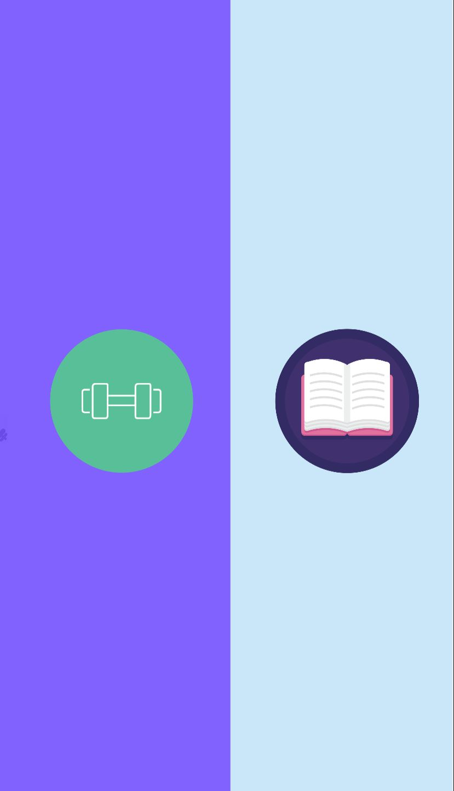

# **Takım İsmi**

Takım F-84

# Ürün İle İlgili Bilgiler

## Takım Elemanları

- Muhammet Eren Eygi - Product Owner / Developer
- Tuğçe Kahya - Scrum master / Developer
- Şevval Kayacan - Developer 
- Sabrina Çiçek - Developer
- İsmail Yılmaz - Gruptan Ayrılan Üye

## Ürün İsmi

-- SocApp --

## Product Backlog URL

[F-84 Trello Backlog Board](https://trello.com/b/7xBLaIgo/sprint-1)

## Ürün Açıklaması

- SocApp uygulamamız ile spor yapan ve kitap okuyan bireyleri aynı platform içinde bir araya getirmeyi ve sosyalleşmelerine katkı sağlamayı hedeflemekteyiz. Uygulamamız sayesinde aynı kitabı okuyanlar kendi sohbet kanalına dahil olup kitap hakkında sohbet edebilecekler, aynı antrenmanı yapacak bireyler de birbirleriyle yine kendi sohbet kanallarında tanışabilir ve antrenmanlarıyla ilgili konuşabileceklerdir. Her iki kitlenin de aynı uygulamada sosyalleşmelerini hedeflemekteyiz. Samimi ve güvenilir bir platform oluşturmak istedik.

- **Uygulama birincil fonksiyonu**: Kitap okuyan kişilerin kitap okuma süreçlerinde ve sonrasında aynı kitapla ilgili sohbet etmelerini sağlayan grup sohbeti ortamı oluşturmak, 
Spor yapan insanların günlük aktivitelerinde yalnız kalmalarının önüne geçerek, o spor dalıyla ilgili kişilerle sohbet edebilecekleri ağı oluşturmak.

- **Uygulama ikincil fonksiyonu**: Kişilerin okudukları veya  okumak istedikleri kitaplarla ilgili okuyucuların yorumlarını görmelerini sağlayarak kitap okumalarına ilham sağlamak,
Spor yapmak isteyen ama bir türlü başlayamayan kişilerin, ilgilendikleri spor dalıyla ilgili yorumları okumalarını sağlayarak spora teşvik etmek.

## Ürün Özellikleri

- Spor yapan kişileri bir araya getirerek sosyalleşmelerini sağlamak
- Spor yapmak isteyen kişilerin, ilgilendikleri alanla ilgili yorumları okumaları ve spora ilgi duymalarını sağlama
- Kitap okuyan kişileri sohbet kanalına dahil etme ve sosyalleşmelerine imkan sunma
- Yeni okumak istedikleri kitaplarla ilgili okur yorumlarıyla okuma süreçlerini heyecanlandırma
- Aynı yazardan kitap önerileri
- Sohbet edebilecekleri efektif bir ortam
- Aynı uygulamadan iki farklı hobileriyle ilgili sosyalleşmeye fırsat verme

## Hedef Kitle

- Sporla ilgilenen kişiler
- Spor yapmak isteyen kişiler
- Spor eğitmenleri
- Kitap okuyucuları
- Kitaplarla ilgili sohbet etmek isteyen kişiler
- Sosyalleşmek isteyen kişiler 
- 15 - 65 yaş arası kullanıcılar
- Hobilerini gerçekleştirirken yeni kişilerle tanışmak isteyenler

# Sprint 1

- **Sprint içinde tamamlanması tahmin edilen puan**: 100 Puan

- **Puan tamamlama mantığı**: Toplamda proje boyunca tamamlanması gereken 300 puanlık backlog bulunmaktadır. 3 sprint'e bölündüğünde ilk sprint'in 100 ile başlaması gerektiğine karar verildi.

- **Backlog düzeni ve Story seçimleri**: Backlog'umuz ekip üyelerine geç ulaşılmasına ve ekipten ayrılan üyenin olmasına rağmen oluşturulmuş ve süreç içerisinde güncellenmek zorunda kalınmıştır. Puan tamamlama mantığı göz önünde bulundurularak story yazılmıştır. 

- **Daily Scrum**: Daily Scrum toplantılarının genellikle zoom üzerinden yapılmaya çalışılsa da zamansal sebeplerden ötürü Whatsapp üzerinden de yapılmıştır. Daily Scrum toplantısı örneği jpeg veya word olarak Readme'de tarafımızdan paylaşılmaktadır: 
[Sprint 1 Daily Scrum Chats](DailyScrumMeetingNotesSprint1.docx)

- **Sprint board update**: Sprint board screenshotları: 
 

- **Ürün Durumu**: Ekran görüntüleri:
  
 
  
- **Sprint Review**: 
Alınan kararlar: Kullanıcı login sayfası ui tasarımları yapılmış ancak kodlanma kısmına ekip içi sebeplerden ötürü geçilememiştir., API incelemeleri devam etmektedir. 
Süreçte ekip için iyi olan durumlar: Üyeler birbirini tanıdı, yapacakları hakkında araştırmalar yaptı. Herkesin ürüne bakış açısı olumlu yönde oldu ve diğer iki sprint için daha aktif olmaları yönünde konuşmalar yapıldı. Ürünün özellikleri ve tasarımıyla ilgili kararlar netleştirildi.
Sprint Review katılımcıları: Muhammet Eren Eygi, Tuğçe Kahya, Sabrina Çiçek, Şevval Kayacan

- **Sprint Retrospective:**
  - Roller ile ilgili düzenleme yapılmış, ekipten biri ilk sprintin bitmesine bir gün kala ayrıldığı için developer görevleri düzenlenmiştir. (Bu durum Scrum Master tarafından, bootcamp asistanımızla paylaşılmıştır.)
  - Takım içindeki görev dağılımıyla ilgili düzenleme yapılması kararı alınmıştır.
  - Takım üyelerinin gelecek sprintlerde motivasyonunun artması için konuşmalar yapılmıştır.
  - Takım üyelerinin tamamı ürünü benimsemiş ve gereken iş paylaşımlarına olumlu bakmaları sağlanmıştır.
 

---

## Product Backlog URL

[F-84 Trello Backlog Board](https://trello.com/b/7xBLaIgo/sprint-1)

---